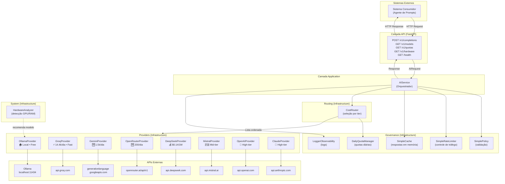
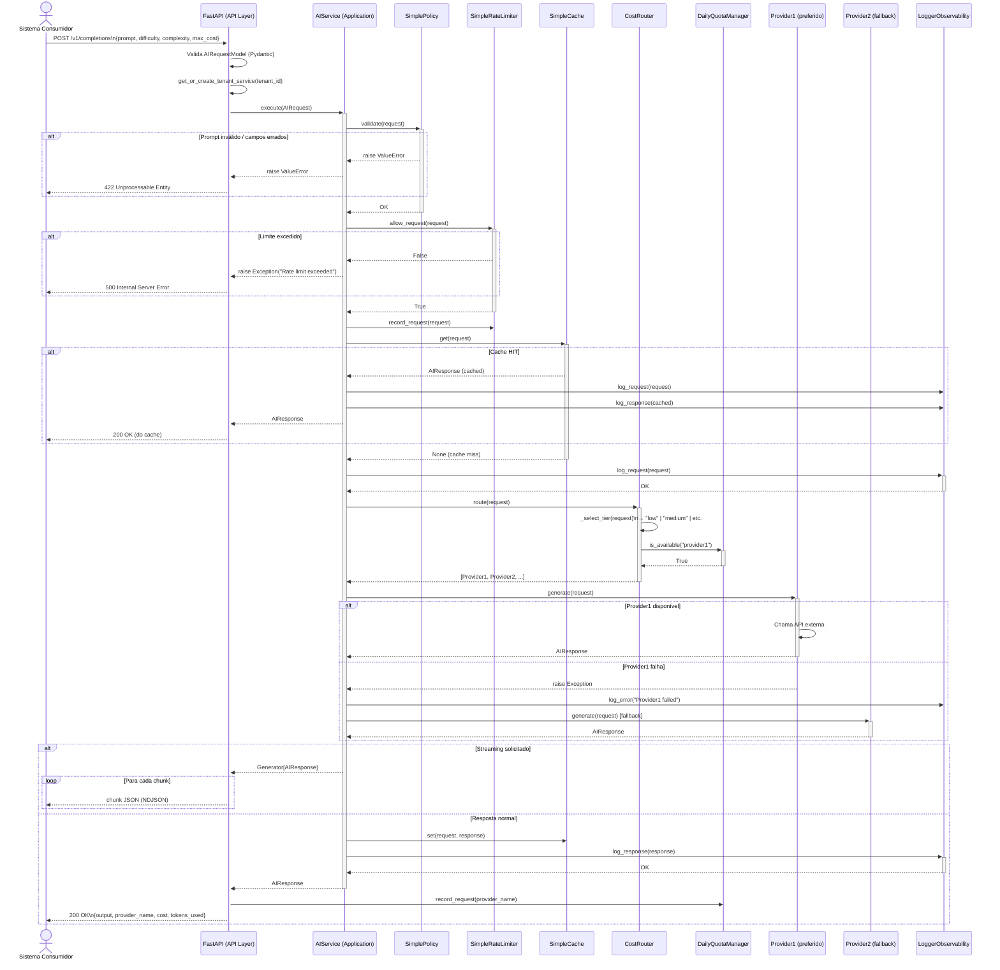
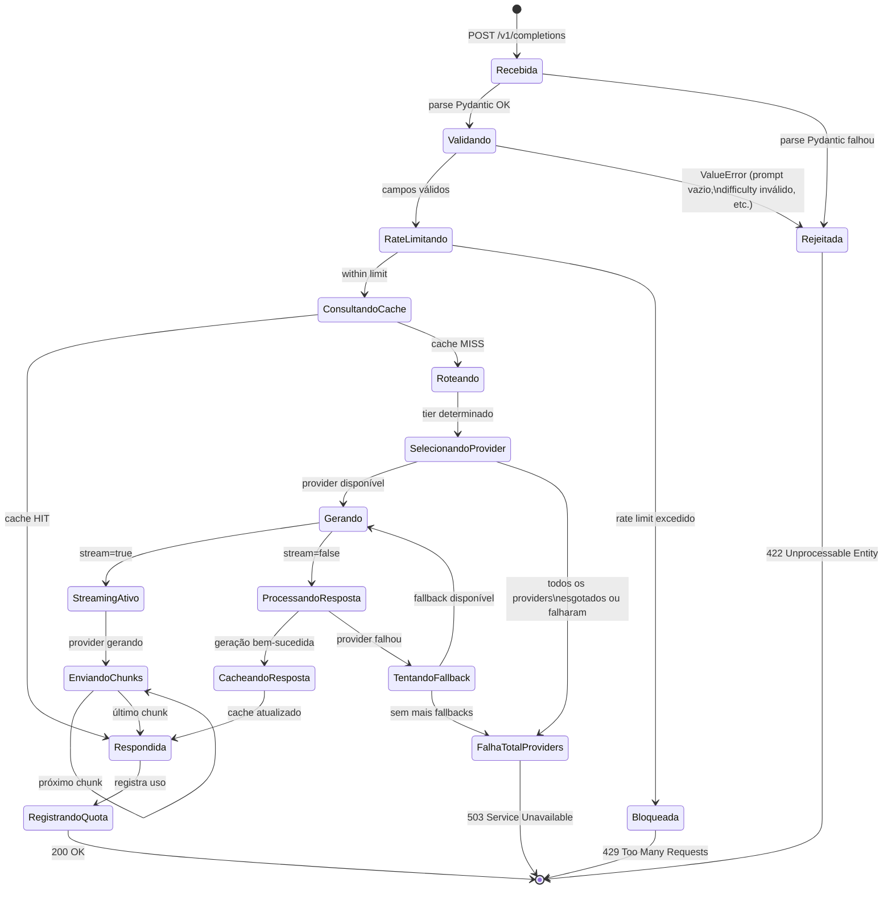
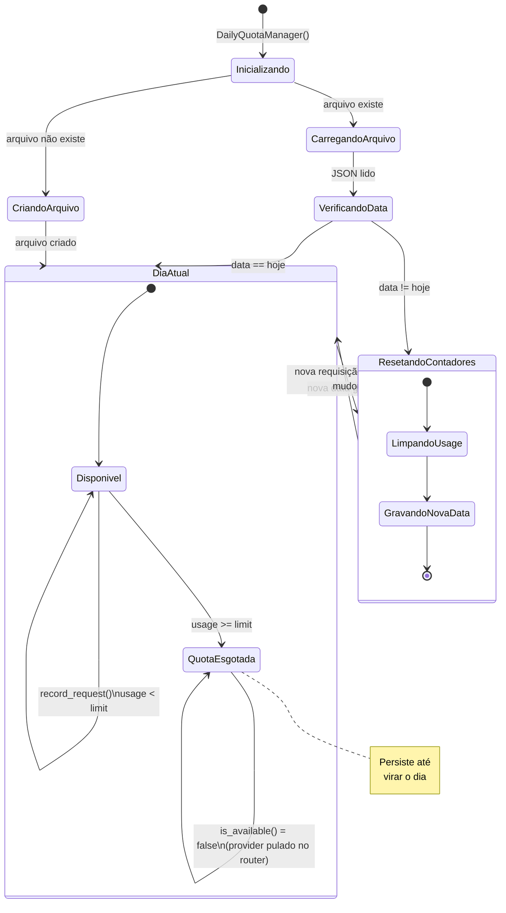
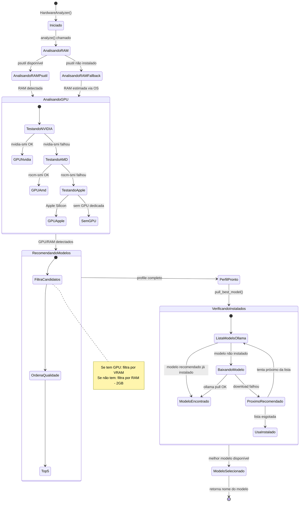
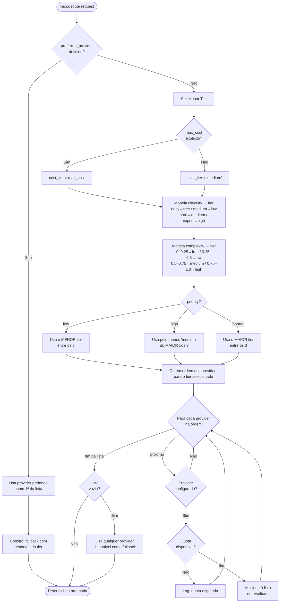
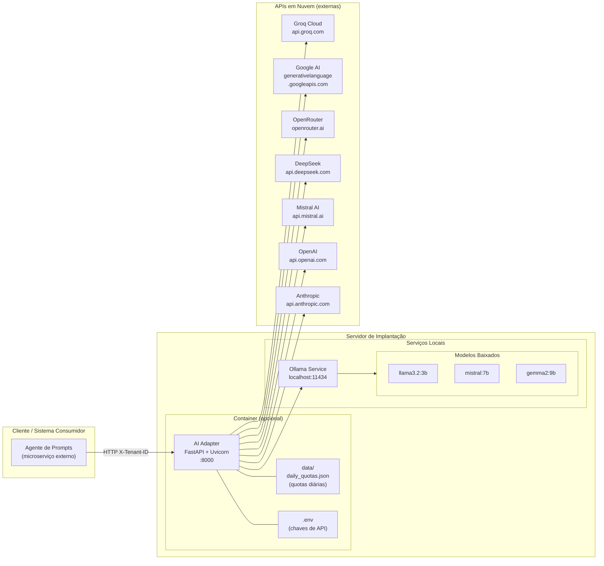

# AI Adapter — Documentação Técnica Completa

> Gateway multi-provider de Inteligência Artificial com seleção inteligente de modelos baseada em custo, capacidade de hardware e complexidade da tarefa.

---

## Índice

1. [Visão Geral](#1-visão-geral)
2. [Teoria e Motivação](#2-teoria-e-motivação)
3. [Arquitetura Clean Architecture](#3-arquitetura-clean-architecture)
4. [Padrões de Projeto](#4-padrões-de-projeto)
5. [Diagrama de Classes UML](#5-diagrama-de-classes-uml)
6. [Diagrama de Componentes](#6-diagrama-de-componentes)
7. [Diagrama de Sequência — Fluxo de Requisição](#7-diagrama-de-sequência--fluxo-de-requisição)
8. [Diagrama de Estado — Ciclo de Vida da Requisição](#8-diagrama-de-estado--ciclo-de-vida-da-requisição)
9. [Diagrama de Estado — Quota Diária](#9-diagrama-de-estado--quota-diária)
10. [Diagrama de Estado — Análise de Hardware](#10-diagrama-de-estado--análise-de-hardware)
11. [Diagrama de Atividades — Roteamento Inteligente](#11-diagrama-de-atividades--roteamento-inteligente)
12. [Diagrama de Implantação](#12-diagrama-de-implantação)
13. [Providers Disponíveis](#13-providers-disponíveis)
14. [Lógica de Roteamento por Tier](#14-lógica-de-roteamento-por-tier)
15. [Gerenciamento de Quotas Diárias](#15-gerenciamento-de-quotas-diárias)
16. [Análise de Hardware e Modelos Locais](#16-análise-de-hardware-e-modelos-locais)
17. [Referência da API REST](#17-referência-da-api-rest)
18. [Configuração e Instalação](#18-configuração-e-instalação)
19. [Estrutura de Arquivos](#19-estrutura-de-arquivos)

---

## 1. Visão Geral

O **AI Adapter** é um microserviço que atua como **gateway unificado** para múltiplos provedores de LLMs (Large Language Models). Ele não expõe modelos diretamente ao consumidor — em vez disso, **decide qual modelo usar** com base em critérios objetivos.

### Responsabilidade Central

```
Sistema Consumidor (Agente de Prompts)
         │
         │  POST /v1/completions
         │  { prompt, difficulty, complexity, max_cost }
         ▼
    ┌─────────────┐
    │  AI Adapter │  ← decide o provider
    └─────────────┘
         │
    ┌────┴────────────────────────────────────┐
    │  Ollama  Groq  Gemini  DeepSeek  OpenAI │
    └─────────────────────────────────────────┘
```

### Princípio de Funcionamento

O sistema consumidor envia a tarefa com **metadados de contexto**:

| Campo | Tipo | Descrição |
|-------|------|-----------|
| `difficulty` | `easy\|medium\|hard\|expert` | Dificuldade estimada da tarefa |
| `complexity` | `float 0.0–1.0` | Complexidade numérica |
| `priority` | `low\|normal\|high` | Urgência da resposta |
| `max_cost` | `free\|low\|medium\|high` | Custo máximo aceitável |

O AI Adapter então **roteia automaticamente** para o provider mais adequado, considerando também quotas diárias disponíveis e hardware local.

---

## 2. Teoria e Motivação

### 2.1 Problema: Proliferação de Provedores

O ecossistema de LLMs está fragmentado. Cada provedor tem:
- APIs incompatíveis entre si
- Modelos com diferentes capacidades
- Preços que variam de gratuito a muito caro
- Limites de requisições distintos
- Latências diferentes

Sem um gateway, cada consumidor precisaria conhecer todos os providers, gerenciar chaves de API, lidar com erros e decidir qual modelo usar — **alto acoplamento e baixa coesão**.

### 2.2 Solução: Gateway com Roteamento Inteligente

O padrão **Gateway** (derivado do Enterprise Integration Patterns) resolve isso com um único ponto de entrada que abstrai toda a complexidade.

```
SEM GATEWAY                          COM GATEWAY

App ──► OpenAI                       App ──► Gateway ──► OpenAI
App ──► Anthropic                                   └──► Anthropic
App ──► Groq                                        └──► Groq
App ──► Ollama                                      └──► Ollama
App ──► DeepSeek                                    └──► DeepSeek
```

### 2.3 Hierarquia de Decisão

O roteamento segue uma hierarquia de prioridades:

```
1. preferred_provider (explícito) → usa diretamente
2. max_cost (restrição de custo) → define teto
3. difficulty (complexidade da tarefa) → define mínimo de qualidade
4. complexity (numérico 0.0–1.0) → refina a escolha
5. priority (urgência) → afeta a trade-off velocidade/custo
6. quota disponível → pula providers esgotados
7. fallback → usa qualquer disponível
```

### 2.4 Teoria de Filas e Rate Limiting

O `SimpleRateLimiter` implementa um **token bucket simplificado** com janela deslizante:

- Remove requisições com timestamp > 60 segundos
- Limita a N requisições por minuto por `client_id`
- Isolamento por tenant (multi-tenancy)

### 2.5 Teoria de Cache

O `SimpleCache` implementa um cache **write-through** em memória:

- Chave = `prompt` (hash implícito por igualdade de string)
- Sem expiração (adequado para testes; produção exigiria TTL)
- Retorna resposta cacheada sem chamar o provider (zero custo)

### 2.6 Análise de Hardware para Modelos Locais

Modelos de linguagem têm requisitos mínimos de hardware. O sistema usa a regra:

```
Se tem GPU → usa VRAM como critério principal
Se não tem GPU → usa RAM disponível - 2GB (reserva para OS)
```

Para cada modelo, define-se `ram_gb` e `vram_gb` mínimos. O sistema lista candidatos compatíveis e os ordena por qualidade decrescente.

---

## 3. Arquitetura Clean Architecture

O projeto implementa a **Clean Architecture** de Robert C. Martin, organizada em 4 camadas concêntricas com dependências sempre apontando para dentro.

```
┌─────────────────────────────────────────────────────┐
│                    API Layer                         │
│              (FastAPI, HTTP, JSON)                   │
├─────────────────────────────────────────────────────┤
│                Application Layer                     │
│              (AIService, Orquestração)               │
├─────────────────────────────────────────────────────┤
│               Infrastructure Layer                   │
│    (Providers, Router, Cache, RateLimiter, etc.)     │
├─────────────────────────────────────────────────────┤
│                   Core Layer                         │
│        (Entidades, Interfaces, Enums)                │
└─────────────────────────────────────────────────────┘
         ↑ Dependências sempre apontam para DENTRO ↑
```

### 3.1 Core Layer (Núcleo de Domínio)

**Regra:** Não depende de nada externo. Não importa nenhum SDK de terceiros.

| Módulo | Responsabilidade |
|--------|-----------------|
| `entities/airequest.py` | Representa a intenção de uso da IA |
| `entities/airesponse.py` | Padroniza respostas de todos os providers |
| `entities/aiprovidermedata.py` | Descreve capacidades de um provider |
| `enums/aicapability.py` | Enumera capacidades: TEXT, VISION, EMBEDDINGS... |
| `interfaces/provider.py` | Contrato abstrato de qualquer provider |
| `interfaces/router.py` | Contrato abstrato de roteamento |
| `interfaces/policy.py` | Contrato abstrato de validação |
| `interfaces/cache.py` | Contrato abstrato de cache |
| `interfaces/rate_limiter.py` | Contrato abstrato de rate limiting |
| `interfaces/observability.py` | Contrato abstrato de logging/monitoramento |
| `interfaces/tool.py` | Contrato abstrato de function calling |

### 3.2 Infrastructure Layer

**Regra:** Implementa as interfaces do Core. Aqui vivem os SDKs externos.

```
infrastructure/
├── providers/          ← implementações concretas de AIProvider
│   ├── openai/
│   ├── anthropic/
│   ├── google/
│   ├── groq/
│   ├── mistral/
│   ├── deepseek/
│   ├── openrouter/
│   └── local/          ← Ollama
├── routing/            ← CostRouter (implementa AIRouter)
├── governance/         ← Policy, Cache, RateLimiter, Observability, QuotaManager
└── system/             ← HardwareAnalyzer
```

### 3.3 Application Layer

**Regra:** Orquestra o fluxo sem conhecer implementações concretas.

`AIService` recebe todas as dependências via injeção e executa o pipeline:

```
validate → rate_limit → cache_check → route → generate → cache_set → log
```

### 3.4 API Layer

**Regra:** Converte HTTP ↔ domain objects. Não contém lógica de negócio.

`FastAPI` recebe `AIRequestModel` (Pydantic), converte para `AIRequest` (domain), delega ao `AIService`, converte `AIResponse` para `AIResponseModel`.

### 3.5 Regra da Dependência

```
API ──► Application ──► Core ◄── Infrastructure
         │                           │
         └───────────────────────────┘
              (via interfaces do Core)
```

A Infrastructure **não é importada** pela Application diretamente — ela é **injetada** pela API Layer através dos construtores.

---

## 4. Padrões de Projeto

### 4.1 Strategy Pattern

**Onde:** Todos os `AIProvider`, `AIRouter`, `AIPolicy`, `AICache`, `AIRateLimiter`

**Teoria:** Define uma família de algoritmos, encapsula cada um e os torna intercambiáveis. O cliente (AIService) não conhece a implementação concreta — usa a interface.

```
        «interface»
        AIProvider
            │
    ┌───────┼───────────────┐
    │       │               │
OpenAI  Anthropic        Groq
(Strategy A) (Strategy B) (Strategy C)
```

**Por que usar:** O `AIService` funciona identicamente independente de qual provider está injetado. Novo provider = nova classe, zero alteração no serviço.

### 4.2 Template Method Pattern

**Onde:** `BaseAgent` → `SimpleAgent`

**Teoria:** Define o esqueleto de um algoritmo na classe base, delegando passos específicos às subclasses.

```python
# BaseAgent define o esqueleto:
def _build_messages(self, user_input):  # ← step concreto
    messages = [system_prompt, *history, user_input]

# Subclasse implementa:
def process(self, user_input) → AIResponse:  # ← abstract
```

### 4.3 Chain of Responsibility Pattern

**Onde:** Pipeline do `AIService` com fallback entre providers

**Teoria:** Passa a requisição por uma cadeia de handlers; cada um pode processar ou passar adiante.

```
Requisição → Provider1 → (falha) → Provider2 → (falha) → Provider3 → Resposta
```

O `CostRouter` retorna uma lista ordenada e o `AIService` itera até obter resposta.

### 4.4 Proxy Pattern

**Onde:** `AIService` em relação aos providers

**Teoria:** Fornece um substituto/representante de outro objeto, controlando acesso e adicionando comportamento (cache, rate limit, logging) sem alterar o objeto real.

```
Cliente ──► AIService (Proxy) ──► Provider (Real Subject)
              ├── valida
              ├── rate limit
              ├── cache
              └── log
```

### 4.5 Abstract Factory Pattern

**Onde:** `aiadapter/factory/` — criação de providers

**Teoria:** Interface para criação de famílias de objetos relacionados sem especificar classes concretas.

```
AbstractFactory
    └── create_provider(name) → AIProvider
```

### 4.6 Facade Pattern

**Onde:** `AIService` para os consumidores da Application Layer

**Teoria:** Fornece interface simplificada para um subsistema complexo.

```
Consumidor chama apenas: ai_service.execute(request)
    ├── Internamente orquestra: policy + rate_limiter + cache + router + providers + observability
    └── Consumidor não precisa conhecer nada disso
```

### 4.7 Dependency Injection (DI)

**Onde:** Construtor do `AIService` e `get_or_create_tenant_service()`

**Teoria:** Dependências são fornecidas externamente em vez de criadas internamente (Inversão de Controle).

```python
# SEM DI (ruim):
class AIService:
    def __init__(self):
        self._router = CostRouter(...)  # acoplado

# COM DI (bom):
class AIService:
    def __init__(self, router: AIRouter, policy: AIPolicy, ...):
        self._router = router  # desacoplado — pode ser mock nos testes
```

### 4.8 Repository Pattern (simplificado)

**Onde:** `SimpleCache` — abstrai o armazenamento de respostas

**Teoria:** Encapsula a lógica de acesso a dados, fornecendo interface orientada a coleções.

### 4.9 Observer Pattern (via Observability)

**Onde:** `LoggerObservability` implementa `AIObservability`

**Teoria:** Define dependência um-para-muitos onde mudanças de estado notificam todos os observadores.

```
AIService ──► AIObservability.log_request()
          ──► AIObservability.log_response()
          ──► AIObservability.log_error()
```

### 4.10 Resumo dos Padrões

| Padrão | Categoria | Onde Aplicado |
|--------|-----------|---------------|
| Strategy | Comportamental | Todos os providers, router, policy, cache, rate limiter |
| Template Method | Comportamental | BaseAgent → SimpleAgent |
| Chain of Responsibility | Comportamental | Fallback entre providers |
| Proxy | Estrutural | AIService sobre os providers |
| Abstract Factory | Criacional | Factory de providers |
| Facade | Estrutural | AIService para consumidores |
| Dependency Injection | Arquitetural | Construtores de AIService |
| Repository | Arquitetural | SimpleCache |
| Observer | Comportamental | AIObservability |

---

## 5. Diagrama de Classes UML

```mermaid
classDiagram
    %% ═══════════════════════════════════════
    %% CORE - Entidades
    %% ═══════════════════════════════════════
    class AIRequest {
        +prompt: str
        +model: Optional[str]
        +messages: Optional[List]
        +temperature: float
        +max_tokens: int
        +context: Optional[Dict]
        +client_id: Optional[str]
        +stream: bool
        +tools: Optional[List]
        +priority: str
        +difficulty: str
        +complexity: float
        +max_cost: str
        +preferred_provider: Optional[str]
    }

    class AIResponse {
        +provider_name: str
        +tokens_used: int
        +cost: float
        +output: Optional[str]
        +is_streaming_chunk: bool
        +tool_calls: Optional[List]
    }

    class AIProviderMetadata {
        +name: str
        +models: List[str]
        +supports_streaming: bool
        +cost_per_1k_tokens: float
        +avg_latency_ms: int
        +is_local: bool
        +daily_free_limit: int
        +capabilities: List[str]
    }

    class AICapability {
        <<enumeration>>
        TEXT
        EMBEDDINGS
        VISION
        FUNCTION_CALLING
        AUDIO
        VIDEO
    }

    %% ═══════════════════════════════════════
    %% CORE - Interfaces (Abstratas)
    %% ═══════════════════════════════════════
    class AIProvider {
        <<abstract>>
        +generate(request: AIRequest) AIResponse
        +get_metadata() AIProviderMetadata
        +supports(capability: AICapability) bool
    }

    class AIRouter {
        <<abstract>>
        +route(request: AIRequest) List[AIProvider]
    }

    class AIPolicy {
        <<abstract>>
        +validate(request: AIRequest) None
    }

    class AICache {
        <<abstract>>
        +get(request: AIRequest) Optional[AIResponse]
        +set(request: AIRequest, response: AIResponse) None
    }

    class AIRateLimiter {
        <<abstract>>
        +allow_request(request: AIRequest) bool
        +record_request(request: AIRequest) None
    }

    class AIObservability {
        <<abstract>>
        +log_request(request: AIRequest) None
        +log_response(response: AIResponse) None
        +log_error(message: str) None
        +log_info(message: str) None
    }

    class AITool {
        <<abstract>>
        +execute(**kwargs) Any
    }

    %% ═══════════════════════════════════════
    %% INFRASTRUCTURE - Providers
    %% ═══════════════════════════════════════
    class OpenAIProvider {
        -_client: OpenAI
        +generate(request) AIResponse
        +get_metadata() AIProviderMetadata
        +supports(capability) bool
        -_generate_stream(response) Generator
        -_estimate_cost(model, tokens) float
    }

    class ClaudeProvider {
        -_client: Anthropic
        +generate(request) AIResponse
        +get_metadata() AIProviderMetadata
        +supports(capability) bool
        -_generate_stream(stream, model) Generator
        -_estimate_cost(model, in, out) float
    }

    class GeminiProvider {
        -_client: genai.Client
        +generate(request) AIResponse
        +get_metadata() AIProviderMetadata
        +supports(capability) bool
        -_generate_new_sdk(request, model) AIResponse
        -_generate_legacy_sdk(request, model) AIResponse
    }

    class GroqProvider {
        -_client: Groq
        +generate(request) AIResponse
        +get_metadata() AIProviderMetadata
        +supports(capability) bool
        -_estimate_cost(model, tokens) float
    }

    class MistralProvider {
        -_client: Mistral
        -_use_sdk: bool
        +generate(request) AIResponse
        +get_metadata() AIProviderMetadata
        +supports(capability) bool
    }

    class DeepSeekProvider {
        -_client: OpenAI
        +generate(request) AIResponse
        +get_metadata() AIProviderMetadata
        +supports(capability) bool
        -_estimate_cost(model, in, out) float
    }

    class OpenRouterProvider {
        -_client: OpenAI
        +generate(request) AIResponse
        +get_metadata() AIProviderMetadata
        +get_free_models() List[str]
        +supports(capability) bool
    }

    class OllamaProvider {
        -_base_url: str
        +is_available() bool
        +list_local_models() List[str]
        +generate(request) AIResponse
        +get_metadata() AIProviderMetadata
        +supports(capability) bool
    }

    %% ═══════════════════════════════════════
    %% INFRASTRUCTURE - Governance
    %% ═══════════════════════════════════════
    class CostRouter {
        -_providers: Dict[str, AIProvider]
        -_quota_manager: DailyQuotaManager
        +route(request: AIRequest) List[AIProvider]
        -_select_tier(request) str
        -_build_fallback_list(tier, exclude) List
        -_complexity_to_tier(complexity) str
        -_tier_level(tier) int
    }

    class SimplePolicy {
        +validate(request: AIRequest) None
    }

    class SimpleCache {
        -_cache: Dict[str, AIResponse]
        +get(request) Optional[AIResponse]
        +set(request, response) None
    }

    class SimpleRateLimiter {
        -rate_limit_per_minute: int
        -requests: defaultdict
        +allow_request(request) bool
        +record_request(request) None
    }

    class LoggerObservability {
        -_logger: Logger
        +log_request(request) None
        +log_response(response) None
        +log_error(message) None
        +log_info(message) None
    }

    class DailyQuotaManager {
        -_quota_file: str
        -_data: dict
        +is_available(provider) bool
        +get_usage(provider) int
        +get_limit(provider) int
        +record_request(provider, count) None
        +mark_exhausted(provider) None
        +get_all_status() Dict
        -_reload_if_new_day() None
        -_load() dict
        -_save() None
    }

    %% ═══════════════════════════════════════
    %% INFRASTRUCTURE - System
    %% ═══════════════════════════════════════
    class HardwareProfile {
        +ram_gb: float
        +cpu_cores: int
        +cpu_threads: int
        +gpu_name: Optional[str]
        +gpu_vram_gb: float
        +has_cuda: bool
        +has_metal: bool
        +has_rocm: bool
        +platform: str
        +recommended_models: List[str]
    }

    class HardwareAnalyzer {
        -_ollama_url: str
        -_profile: Optional[HardwareProfile]
        +analyze() HardwareProfile
        +get_best_local_model(installed) Optional[str]
        +pull_best_model(ollama_provider) Optional[str]
        +summary() dict
        -_detect_gpu() dict
        -_recommend_models(profile) List[str]
        -_estimate_ram_fallback() float
    }

    %% ═══════════════════════════════════════
    %% APPLICATION
    %% ═══════════════════════════════════════
    class AIService {
        -_router: AIRouter
        -_policy: AIPolicy
        -_observability: AIObservability
        -_rate_limiter: AIRateLimiter
        -_cache: AICache
        -_tools: Dict[str, AITool]
        +execute(request) AIResponse
        -_handle_streaming_response(request, gen, name) Generator
        -_handle_tool_calls(tool_calls) List
    }

    %% ═══════════════════════════════════════
    %% AGENTS
    %% ═══════════════════════════════════════
    class BaseAgent {
        <<abstract>>
        +name: str
        +ai_service: AIService
        +system_prompt: Optional[str]
        +conversation_history: List
        +process(user_input) AIResponse
        +add_to_history(role, content) None
        +get_conversation_history() List
        +clear_history() None
        -_build_messages(user_input) List
    }

    class SimpleAgent {
        +process(user_input) AIResponse
    }

    %% ═══════════════════════════════════════
    %% RELACIONAMENTOS
    %% ═══════════════════════════════════════

    %% Herança - Providers
    AIProvider <|-- OpenAIProvider
    AIProvider <|-- ClaudeProvider
    AIProvider <|-- GeminiProvider
    AIProvider <|-- GroqProvider
    AIProvider <|-- MistralProvider
    AIProvider <|-- DeepSeekProvider
    AIProvider <|-- OpenRouterProvider
    AIProvider <|-- OllamaProvider

    %% Herança - Governance
    AIRouter <|-- CostRouter
    AIPolicy <|-- SimplePolicy
    AICache <|-- SimpleCache
    AIRateLimiter <|-- SimpleRateLimiter
    AIObservability <|-- LoggerObservability

    %% Herança - Agents
    BaseAgent <|-- SimpleAgent

    %% Composição - AIService
    AIService o-- AIRouter
    AIService o-- AIPolicy
    AIService o-- AIObservability
    AIService o-- AIRateLimiter
    AIService o-- AICache
    AIService o-- AITool

    %% Composição - CostRouter
    CostRouter o-- AIProvider
    CostRouter o-- DailyQuotaManager

    %% Composição - HardwareAnalyzer
    HardwareAnalyzer ..> HardwareProfile : cria
    HardwareAnalyzer ..> OllamaProvider : usa

    %% Dependências de Entidades
    AIService ..> AIRequest : usa
    AIService ..> AIResponse : usa
    AIProvider ..> AIRequest : consome
    AIProvider ..> AIResponse : produz
    AIProvider ..> AIProviderMetadata : retorna
    AIProvider ..> AICapability : usa
    AIRouter ..> AIRequest : analisa
```



---

## 6. Diagrama de Componentes



---

## 7. Diagrama de Sequência — Fluxo de Requisição



---

## 8. Diagrama de Estado — Ciclo de Vida da Requisição



---

## 9. Diagrama de Estado — Quota Diária



---

## 10. Diagrama de Estado — Análise de Hardware



---

## 11. Diagrama de Atividades — Roteamento Inteligente



---

## 12. Diagrama de Implantação



---

## 13. Providers Disponíveis

### Hierarquia por Custo e Qualidade

```
QUALIDADE / CUSTO
        ▲
        │  ┌────────────────────────────────────────────┐
  alto  │  │  GPT-4o ($2.50/1M)   Claude Sonnet ($3/1M) │
        │  ├────────────────────────────────────────────┤
        │  │  GPT-4o-mini (0.15)  Claude Haiku (0.25)   │
 médio  │  │  Gemini Pro (1.25)   Mistral Medium (2.70)  │
        │  ├────────────────────────────────────────────┤
        │  │  Groq 70B (0.79)     DeepSeek Chat (0.28)  │
  baixo │  │  Gemini Flash (0.075) Mistral Small (0.60) │
        │  ├────────────────────────────────────────────┤
  zero  │  │  Groq 8B (0.08)  OpenRouter Free (grátis)  │
        │  │  Gemini Free (grátis)  Ollama (local)       │
        │  └────────────────────────────────────────────┘
        └─────────────────────────────────────────────────► VELOCIDADE
                                                     lento      rápido
```

### Tabela Completa de Providers

| Provider | Chave Env | Free Tier | Latência | Modelos Destaque |
|----------|-----------|-----------|----------|-----------------|
| **Ollama** | — (local) | Ilimitado (local) | ~500ms | llama3.2, mistral, gemma2 |
| **Groq** | `GROQ_API_KEY` | 14.400 req/dia | ~300ms | llama-3.1-8b-instant, llama-3.3-70b |
| **Gemini** | `GEMINI_API_KEY` | 1.500 req/dia | ~600ms | gemini-1.5-flash, gemini-1.5-pro |
| **OpenRouter** | `OPENROUTER_API_KEY` | ~200 req/dia | ~1.500ms | 8+ modelos `:free` |
| **DeepSeek** | `DEEPSEEK_API_KEY` | $5 crédito inicial | ~1.000ms | deepseek-chat, deepseek-reasoner |
| **Mistral** | `MISTRAL_API_KEY` | Créditos iniciais | ~900ms | mistral-small, codestral |
| **OpenAI** | `OPENAI_API_KEY` | Sem free tier | ~800ms | gpt-4o, gpt-4o-mini |
| **Anthropic** | `ANTHROPIC_API_KEY` | Sem free tier | ~1.200ms | claude-3.5-sonnet, claude-3-haiku |

### Modelos Gratuitos OpenRouter

```
meta-llama/llama-3.2-3b-instruct:free
meta-llama/llama-3.2-1b-instruct:free
google/gemma-2-9b-it:free
mistralai/mistral-7b-instruct:free
microsoft/phi-3-mini-128k-instruct:free
nousresearch/hermes-3-llama-3.1-405b:free
huggingfaceh4/zephyr-7b-beta:free
qwen/qwen-2-7b-instruct:free
```

---

## 14. Lógica de Roteamento por Tier

### Mapeamento Difficulty → Tier

| difficulty | Tier mínimo | Raciocínio |
|-----------|-------------|-----------|
| `easy` | `free` | Tarefas triviais: resumo simples, classificação básica |
| `medium` | `low` | Tarefas comuns: análise, redação, tradução |
| `hard` | `medium` | Raciocínio complexo, código, múltiplos passos |
| `expert` | `high` | Pesquisa avançada, arquitetura de sistemas, CoT profundo |

### Mapeamento Complexity → Tier

| complexity | Tier | Exemplo de tarefa |
|-----------|------|-----------------|
| 0.0 – 0.25 | `free` | "Qual é a capital do Brasil?" |
| 0.25 – 0.50 | `low` | "Resuma este texto de 500 palavras" |
| 0.50 – 0.75 | `medium` | "Explique a diferença entre TCP e UDP com exemplos" |
| 0.75 – 1.00 | `high` | "Projete uma arquitetura de microserviços para..." |

### Ordem de Preferência por Tier

```
TIER FREE:
  1. Ollama (local, zero latência de rede)
  2. OpenRouter :free models
  3. Groq (free tier, muito rápido)
  4. Gemini Flash (free tier)
  5. DeepSeek (fallback muito barato)

TIER LOW:
  1. Groq (rápido, baratíssimo)
  2. Gemini Flash (bom equilíbrio)
  3. DeepSeek Chat (ótima qualidade/preço)
  4. Mistral Small
  5. Ollama (fallback local)
  6. OpenAI GPT-4o-mini

TIER MEDIUM:
  1. DeepSeek (melhor custo-benefício)
  2. Mistral Medium
  3. Groq 70B
  4. Gemini Pro
  5. GPT-4o-mini
  6. Claude Haiku

TIER HIGH:
  1. GPT-4o
  2. Claude 3.5 Sonnet
  3. Gemini Pro
  4. DeepSeek Reasoner (CoT)
  5. Mistral Large
```

### Impacto da Priority

```
priority=low  → força o MENOR tier calculado (economiza custo)
priority=high → garante pelo menos tier MEDIUM (qualidade mínima)
priority=normal → usa o MAIOR tier entre difficulty/complexity/max_cost
```

---

## 15. Gerenciamento de Quotas Diárias

### Estrutura do Arquivo de Estado

```json
{
  "date": "2026-03-12",
  "usage": {
    "groq": 142,
    "gemini": 38,
    "openrouter_free": 12,
    "together_free": 0,
    "cohere": 5,
    "mistral": 0
  }
}
```

### Limites Configurados

| Provider | Limite/dia | Fonte |
|----------|-----------|-------|
| `groq` | 14.400 req | Groq free tier (~10 req/min) |
| `gemini` | 1.500 req | Google AI Studio free |
| `openrouter_free` | 200 req | OpenRouter free models |
| `together_free` | 300 req | Together AI free tier |
| `cohere` | 1.000 req | Cohere trial (~33/dia estimado) |
| `mistral` | 500 req | Estimado para free tier |

### Ciclo de Reset

```
┌──────────────────────────────────────────────────────┐
│  Início do dia (00:00)                               │
│  ┌──────────────┐                                    │
│  │ data != hoje │ → reseta todos os contadores para 0│
│  └──────────────┘   grava nova data                  │
│                                                      │
│  Durante o dia                                       │
│  ┌─────────────────────────────────────────────────┐ │
│  │ record_request("groq") → usage["groq"] += 1     │ │
│  │ is_available("groq"):                           │ │
│  │   if usage < 14.400 → True (router usa)         │ │
│  │   if usage >= 14.400 → False (router pula)      │ │
│  └─────────────────────────────────────────────────┘ │
└──────────────────────────────────────────────────────┘
```

### Tratamento de Erro de Quota pela API

Quando a API retorna erro de quota (ex: 429 da Groq), o código pode chamar:

```python
quota_manager.mark_exhausted("groq")
# → usage["groq"] = limit (14.400)
# → is_available("groq") = False até amanhã
```

---

## 16. Análise de Hardware e Modelos Locais

### Algoritmo de Detecção

```
1. RAM Total
   └── psutil.virtual_memory().total
   └── (fallback) /proc/meminfo | sysctl | wmic

2. CPU
   └── psutil.cpu_count(logical=False)  # cores físicos
   └── psutil.cpu_count(logical=True)   # threads

3. GPU (em ordem de tentativa)
   ├── NVIDIA: nvidia-smi --query-gpu=name,memory.total
   ├── AMD:    rocm-smi --showmeminfo vram
   └── Apple:  system_profiler SPDisplaysDataType
```

### Critério de Recomendação de Modelos

```python
# Se tem GPU → usa VRAM como critério
if gpu_vram_gb > 0:
    compatível = modelo.vram_gb <= gpu_vram_gb

# Se não tem GPU → usa RAM (menos 2GB para o OS)
else:
    compatível = modelo.ram_gb <= (ram_gb - 2.0)
```

### Tabela de Requisitos dos Modelos

| Modelo | RAM mín. | VRAM mín. | Qualidade |
|--------|----------|-----------|-----------|
| llama3.2:1b | 2 GB | 1,5 GB | basic |
| llama3.2:3b | 4 GB | 2,5 GB | low |
| phi3.5 | 4 GB | 2,5 GB | low |
| gemma2:2b | 4 GB | 2,0 GB | low |
| llama3.1:8b | 8 GB | 5,0 GB | medium |
| mistral:7b | 8 GB | 4,5 GB | medium |
| gemma2:9b | 8 GB | 5,5 GB | medium |
| qwen2.5:7b | 8 GB | 5,0 GB | medium |
| llama3.3:70b | 48 GB | 40 GB | excellent |
| qwen2.5:72b | 48 GB | 40 GB | excellent |

### Exemplos de Recomendações por Hardware

| Hardware | Modelo Recomendado |
|----------|-------------------|
| 4 GB RAM, sem GPU | phi3.5 ou gemma2:2b |
| 8 GB RAM, sem GPU | mistral:7b ou llama3.1:8b |
| 16 GB RAM + GTX 1660 (6GB VRAM) | mistral:7b (via GPU) |
| 32 GB RAM + RTX 3090 (24GB VRAM) | gemma2:9b (via GPU) |
| 64 GB RAM + A100 (40GB VRAM) | llama3.3:70b |
| Apple M1 Pro (16 GB unified) | llama3.1:8b (via Metal) |

---

## 17. Referência da API REST

### Base URL

```
http://localhost:8000
```

### Headers Obrigatórios

```
X-Tenant-ID: <identificador-do-tenant>
Content-Type: application/json
```

---

### `POST /v1/completions`

Submete uma requisição de geração de texto.

**Request Body:**

```json
{
  "prompt": "Explique o que é Clean Architecture",
  "model": null,
  "messages": null,
  "temperature": 0.7,
  "max_tokens": 512,
  "stream": false,
  "tools": null,
  "priority": "normal",
  "difficulty": "medium",
  "complexity": 0.5,
  "max_cost": "low",
  "preferred_provider": null
}
```

| Campo | Tipo | Default | Descrição |
|-------|------|---------|-----------|
| `prompt` | `string` | — | Texto da requisição (obrigatório) |
| `model` | `string\|null` | `null` | Modelo específico (o router decide se null) |
| `messages` | `array\|null` | `null` | Histórico no formato `[{role, content}]` |
| `temperature` | `float` | `0.7` | Aleatoriedade (0.0–2.0) |
| `max_tokens` | `int` | `512` | Limite de tokens na resposta |
| `stream` | `bool` | `false` | Resposta em streaming NDJSON |
| `priority` | `string` | `"normal"` | `low\|normal\|high` |
| `difficulty` | `string` | `"medium"` | `easy\|medium\|hard\|expert` |
| `complexity` | `float` | `0.5` | Complexidade 0.0–1.0 |
| `max_cost` | `string` | `"medium"` | `free\|low\|medium\|high` |
| `preferred_provider` | `string\|null` | `null` | Nome do provider preferido |

**Response (stream=false):**

```json
{
  "output": "Clean Architecture é um padrão proposto por...",
  "tokens_used": 234,
  "provider_name": "groq",
  "cost": 0.0000187,
  "is_streaming_chunk": false,
  "tool_calls": null
}
```

**Response (stream=true):** NDJSON — um objeto por linha:

```
{"output": "Clean", "tokens_used": 0, "provider_name": "groq", "cost": 0.0, "is_streaming_chunk": true}
{"output": " Architecture", "tokens_used": 0, "provider_name": "groq", "cost": 0.0, "is_streaming_chunk": true}
...
```

---

### `GET /v1/models`

Lista todos os modelos disponíveis nos providers configurados.

**Response:**

```json
{
  "models": [
    {
      "id": "llama-3.1-8b-instant",
      "provider": "groq",
      "supports_streaming": true,
      "cost_per_1k_tokens": 0.00008,
      "is_free": false,
      "is_local": false,
      "capabilities": ["text", "function_calling"]
    },
    {
      "id": "meta-llama/llama-3.2-3b-instruct:free",
      "provider": "openrouter",
      "supports_streaming": true,
      "cost_per_1k_tokens": 0.0,
      "is_free": true,
      "is_local": false,
      "capabilities": ["text"]
    },
    {
      "id": "llama3.2:3b",
      "provider": "ollama",
      "supports_streaming": true,
      "cost_per_1k_tokens": 0.0,
      "is_free": true,
      "is_local": true,
      "capabilities": ["text"]
    }
  ],
  "total": 32
}
```

---

### `GET /v1/quotas`

Retorna o status atual das quotas diárias.

**Response:**

```json
{
  "groq": {
    "usage": 142,
    "limit": 14400,
    "remaining": 14258,
    "available": true,
    "reset_at": "amanhã 00:00"
  },
  "gemini": {
    "usage": 38,
    "limit": 1500,
    "remaining": 1462,
    "available": true,
    "reset_at": "amanhã 00:00"
  }
}
```

---

### `GET /v1/hardware`

Retorna informações de hardware detectado e modelos recomendados.

**Response:**

```json
{
  "ram_gb": 16.0,
  "cpu_cores": 8,
  "cpu_threads": 16,
  "gpu": "NVIDIA GeForce RTX 3060",
  "gpu_vram_gb": 12.0,
  "acceleration": "CUDA",
  "recommended_models": [
    "gemma2:9b",
    "llama3.1:8b",
    "mistral:7b",
    "qwen2.5:7b",
    "phi3.5"
  ]
}
```

---

### `GET /health`

Verifica disponibilidade do serviço e de todos os providers.

**Response:**

```json
{
  "status": "ok",
  "providers": {
    "ollama": { "available": true, "models": ["llama3.2:3b", "mistral:7b"] },
    "groq": { "available": true, "models": ["llama-3.1-8b-instant", "llama-3.3-70b"] },
    "gemini": { "available": true, "models": ["gemini-1.5-flash", "gemini-1.5-pro"] }
  },
  "quota_status": { "groq": { "usage": 142, "limit": 14400, "available": true } }
}
```

---

### `GET /v1/tenants/{tenant_id}/stats`

Retorna estatísticas de um tenant específico.

---

## 18. Configuração e Instalação

### Pré-requisitos

- Python 3.10+
- (Opcional) Ollama instalado: https://ollama.ai

### Instalação

```bash
# 1. Clone e entre na pasta
cd assistente-inteligente

# 2. Crie ambiente virtual
python -m venv .venv
source .venv/bin/activate     # Linux/macOS
.venv\Scripts\activate         # Windows

# 3. Instale dependências básicas
pip install -e .

# 4. Instale todos os providers
pip install -e ".[all-providers]"

# 5. Configure as variáveis de ambiente
cp .env.example .env
# Edite .env com suas chaves de API

# 6. (Opcional) Inicie o Ollama
ollama serve

# 7. Inicie o servidor
python main.py
# ou para desenvolvimento:
uvicorn aiadapter.api.main:app --reload
```

### Configuração Mínima (só free)

Para começar sem gastar nada, configure apenas:

```env
GROQ_API_KEY=gsk_...          # groq.com - cadastro gratuito
GEMINI_API_KEY=AIza...         # aistudio.google.com - cadastro gratuito
OPENROUTER_API_KEY=sk-or-...   # openrouter.ai - cadastro gratuito
```

E instale o Ollama para modelos locais completamente gratuitos.

### Exemplo de Uso (cURL)

```bash
# Tarefa simples — usará free tier automaticamente
curl -X POST http://localhost:8000/v1/completions \
  -H "Content-Type: application/json" \
  -H "X-Tenant-ID: meu-agente" \
  -d '{
    "prompt": "Qual é a capital do Brasil?",
    "difficulty": "easy",
    "complexity": 0.1,
    "max_cost": "free"
  }'

# Tarefa complexa — usará modelo de alta qualidade
curl -X POST http://localhost:8000/v1/completions \
  -H "Content-Type: application/json" \
  -H "X-Tenant-ID: meu-agente" \
  -d '{
    "prompt": "Projete uma arquitetura de event sourcing para um sistema bancário",
    "difficulty": "expert",
    "complexity": 0.95,
    "max_cost": "high",
    "max_tokens": 2048
  }'

# Verificar quotas
curl http://localhost:8000/v1/quotas \
  -H "X-Tenant-ID: meu-agente"

# Verificar hardware
curl http://localhost:8000/v1/hardware \
  -H "X-Tenant-ID: meu-agente"
```

---

## 19. Estrutura de Arquivos

```
assistente-inteligente/
│
├── main.py                          # Entry point: carrega .env e inicia uvicorn
├── pyproject.toml                   # Dependências e configurações do projeto
├── .env.example                     # Template de variáveis de ambiente
├── .gitignore
├── README.md
│
├── data/                            # Dados persistidos em runtime
│   └── daily_quotas.json            # Estado das quotas diárias (auto-gerado)
│
└── aiadapter/                       # Pacote principal
    │
    ├── config/
    │   └── settings.py              # Carrega variáveis de ambiente → Settings
    │
    ├── core/                        # ← NÚCLEO (sem dependências externas)
    │   ├── entities/
    │   │   ├── airequest.py         # Entidade: intenção de uso da IA
    │   │   ├── airesponse.py        # Entidade: resposta padronizada
    │   │   └── aiprovidermedata.py  # Entidade: metadados de um provider
    │   ├── enums/
    │   │   └── aicapability.py      # Enum: capacidades (TEXT, VISION, etc.)
    │   └── interfaces/
    │       ├── provider.py          # Contrato: AIProvider (ABC)
    │       ├── router.py            # Contrato: AIRouter (ABC)
    │       ├── policy.py            # Contrato: AIPolicy (ABC)
    │       ├── cache.py             # Contrato: AICache (ABC)
    │       ├── rate_limiter.py      # Contrato: AIRateLimiter (ABC)
    │       ├── observability.py     # Contrato: AIObservability (ABC)
    │       └── tool.py              # Contrato: AITool (ABC)
    │
    ├── infrastructure/              # ← INFRAESTRUTURA (SDKs externos aqui)
    │   ├── providers/
    │   │   ├── openai/
    │   │   │   └── openai_provider.py
    │   │   ├── anthropic/
    │   │   │   └── calude_provider.py
    │   │   ├── google/
    │   │   │   └── gemini_provider.py
    │   │   ├── groq/
    │   │   │   └── groq_provider.py    ← NOVO
    │   │   ├── mistral/
    │   │   │   └── mistral_provider.py ← NOVO
    │   │   ├── deepseek/
    │   │   │   └── deepseek_provider.py ← NOVO
    │   │   ├── openrouter/
    │   │   │   └── openrouter_provider.py ← NOVO
    │   │   └── local/
    │   │       └── ollama_provider.py
    │   ├── routing/
    │   │   └── cost_router.py       # Seleção inteligente por tier
    │   ├── governance/
    │   │   ├── cost_router.py       # Re-export (compatibilidade)
    │   │   ├── simple_policy.py     # Validação de requisições
    │   │   ├── simple_cache.py      # Cache em memória
    │   │   ├── simple_rate_limiter.py # Rate limiting por minuto
    │   │   ├── logger_observability.py # Logging estruturado
    │   │   └── daily_quota_manager.py  # Quotas diárias ← NOVO
    │   └── system/
    │       └── hardware_analyzer.py    # Detecção de hardware ← NOVO
    │
    ├── application/
    │   └── ai_service.py            # Orquestrador principal (pipeline completo)
    │
    ├── api/
    │   └── main.py                  # FastAPI: rotas, DI, inicialização de providers
    │
    ├── agents/
    │   ├── base_agent.py            # Agente base com histórico de conversação
    │   ├── simple_agent.py          # Implementação simples
    │   └── agent_manager.py         # Gerenciador de múltiplos agentes
    │
    └── factory/
        ├── abstract_factory.py      # Interface de fábrica de providers
        └── factory_provider.py      # Fábrica concreta
```

---

*Documentação gerada para o AI Adapter v2.0.0*
*Arquitetura: Clean Architecture + Strategy + Chain of Responsibility + Proxy + DI*
